<picture>
  <source media="(prefers-color-scheme: dark)" srcset="d1.svg">
  <source media="(prefers-color-scheme: light)" srcset="l1.svg">
  
</picture>

### Hi there 👋

- 🔭 I'm currently working on **agentic AI systems** for manufacturing clients — multi-agent orchestration with LangGraph & CrewAI
- 🌱 I'm currently learning **LLMOps** and Responsible AI practices (prompt guardrails, human-in-the-loop validation)
- 👯 I'm looking to collaborate on **RAG pipelines, AI agents, and production LLM systems**
- 💬 Ask me about **LangChain, LangGraph, FastAPI, RAG, or agentic workflows**
- 📫 Reach me at **abhipawar025@gmail.com**
- ⚡ Fun fact: I've shipped 3 POC-to-production AI systems that manage 50+ assets per plant across manufacturing sites
